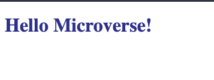

# Hello-Microverse

> This is simple project to demonstrate understanding of basic HTML and CSS. 
> I am building a professional project and giving attention to the project documentation by including a descriptive README as a training exercise experience.

## Build with
1. HTML
2. style with CSS.
3. Github
4. VSCode

### Deployment
- Deployed using github pages

[live.demo](https://dansam5k.github.io/Hello-Microverse/)
## Author

👤 **Daniel Samuel**
- Github: [DanSam5k](https://github.com/DanSam5k)
- Twitter: [@_dan_sam](https://twitter.com/_dan_sam)
- Linkedin: [dansamuel](https://www.linkedin.com/in/dansamuel/)
## Show your support

Give a ⭐️ if you like this project!

## 📝 License

This project is [MIT](https://docs.github.com/en/github/creating-cloning-and-archiving-repositories/licensing-a-repository) licensed.
## 🤝 Contributing

Contributions, issues, and feature requests are welcome!

Feel free to check the [issues page](https://github.com/DanSam5K/Hello-Microverse/issues).

## Show your support

Give a ⭐️ if you like this project!

## Acknowledgments

- Hat tip to anyone whose code was used
- Inspiration
- etc

## 📝 License

This project is [MIT](./MIT.md) licensed.
